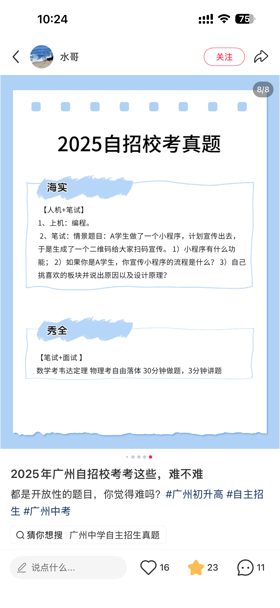
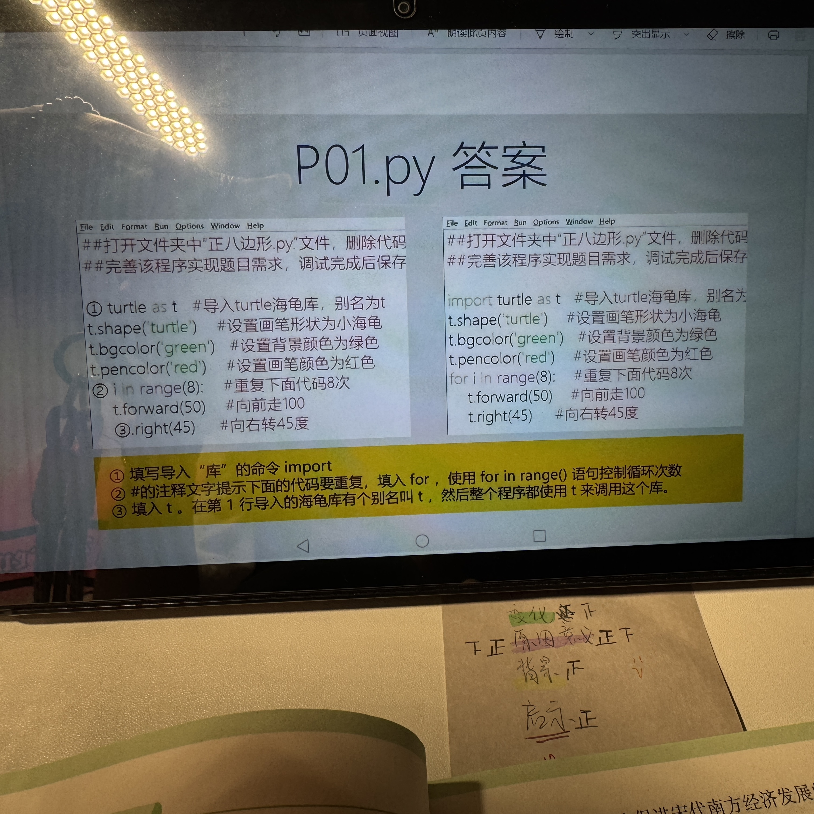
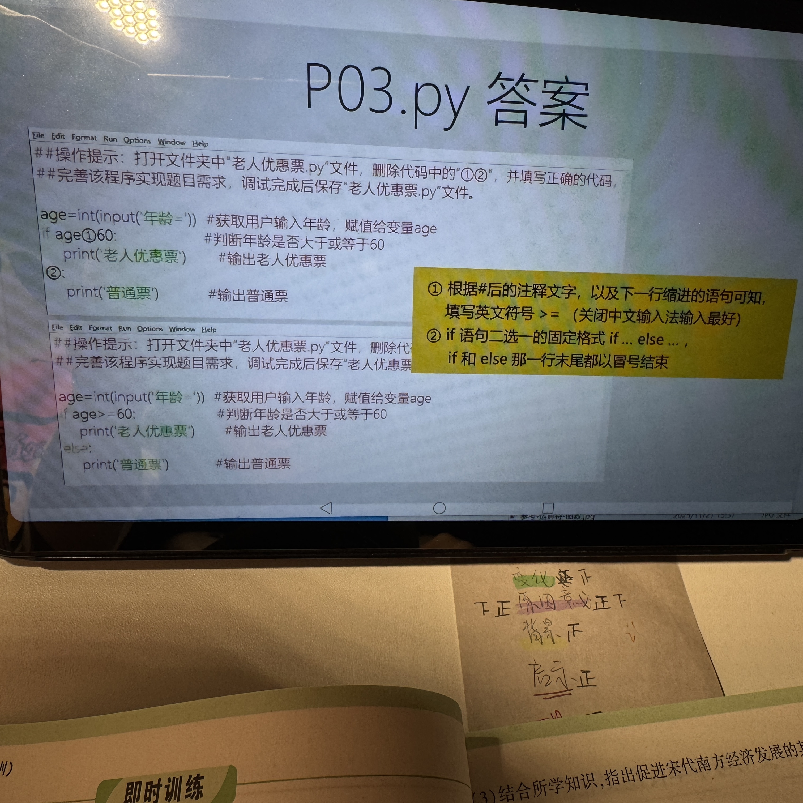
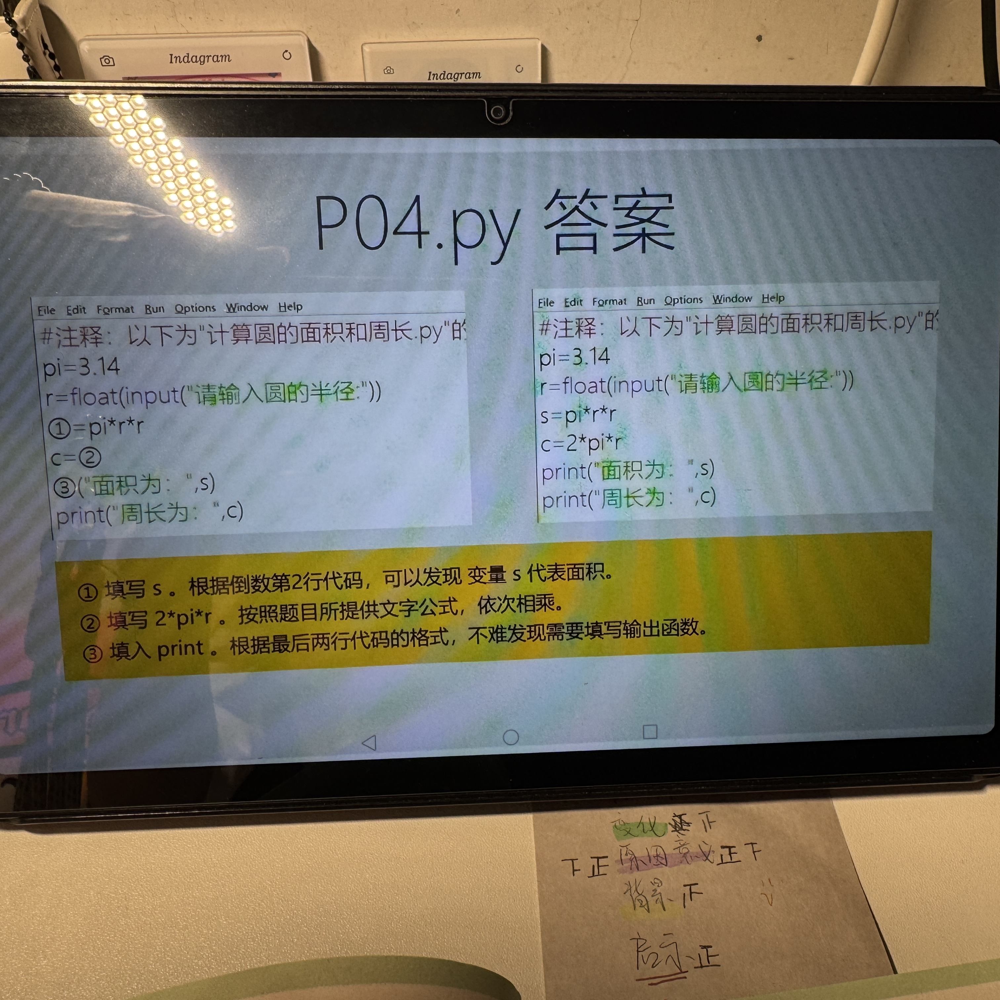
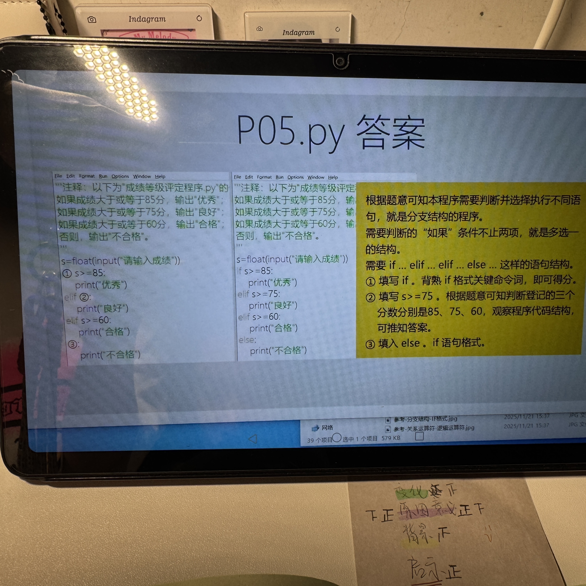
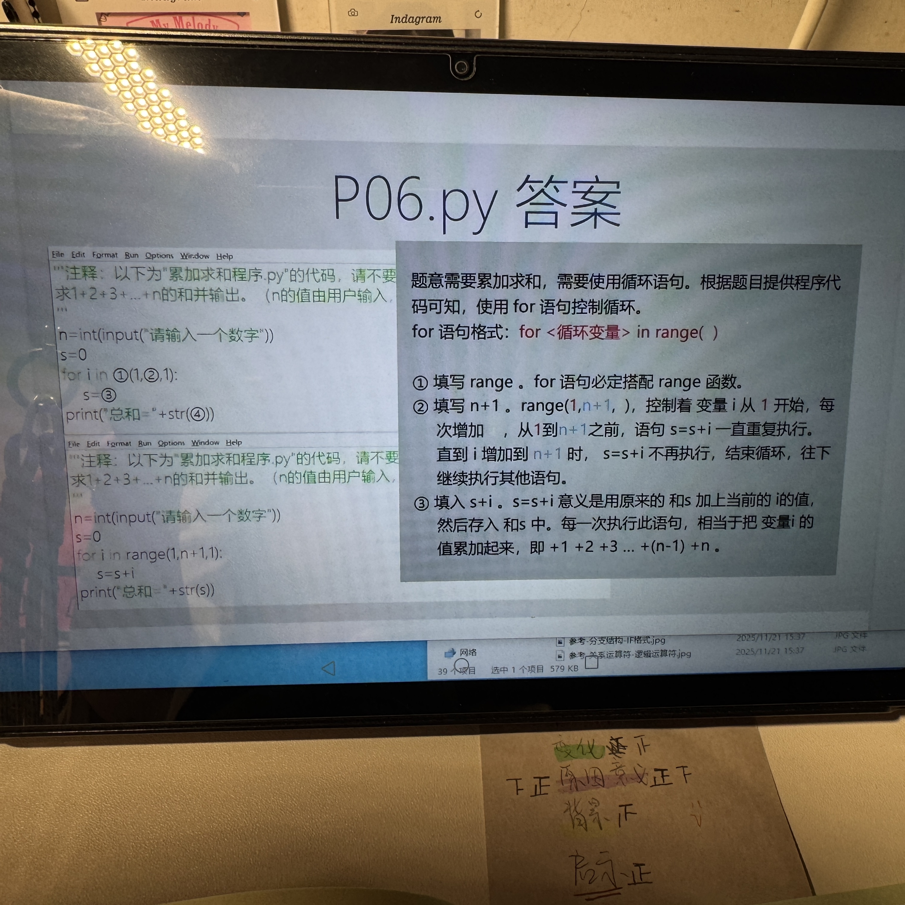

<div class="hero">
  <div>
    <div class="tag">自主招生 Python / 2 小时</div>
    <div class="hero-title mt-5">从 P01-P06<br>变成会迁移</div>
    <div class="hero-subtitle">
      今天不补一堆新知识。只把已经见过的 6 类题型压成固定模板：
      看注释、找变量、补语法、会表达。
    </div>
  </div>
  <div class="panel blue-panel">
    <h3>本节课目标</h3>
    <ul class="checklist">
      <li>看到注释能判断空格要填什么。</li>
      <li>把 P01-P06 改成同类新题。</li>
      <li>避开冒号、缩进、引号、变量名这些扣分点。</li>
      <li>能把 Python 和校园小项目讲清楚。</li>
    </ul>
  </div>
</div>

<!--
讲法：先稳住她，不要让她觉得要重新学一门语言。强调今天是“归纳”和“迁移”，不是从零学 Python。
-->

---

# 先定边界：不做 Python 科普

<div class="grid-2">
  <div class="panel gold-panel">
    <h3>不要追求</h3>
    <ul>
      <li>复杂算法</li>
      <li>第三方库安装</li>
      <li>数据库、后端、小程序开发</li>
      <li>把所有 Python 语法都讲完</li>
    </ul>
  </div>
  <div class="panel green-panel">
    <h3>只追求</h3>
    <ul>
      <li>补全基础代码</li>
      <li>读懂题目注释</li>
      <li>会改一个类似题</li>
      <li>开放题能说出项目思路</li>
    </ul>
  </div>
</div>

<div class="panel mt-6">
一句话判断：自招考的是“能不能用基础编程解决校园小问题”，不是竞赛编程。
</div>

<!--
讲法：如果她紧张，就告诉她：你已经见过核心题型，今天是把它们整理成“考试工具箱”。
-->

---

# 两小时路线

<div class="grid-3">
  <div class="model-card">
    <div class="big-number">1</div>
    <h3>0-20 分钟</h3>
    <p>考什么、怎么补代码、语法扣分点。</p>
  </div>
  <div class="model-card">
    <div class="big-number">2</div>
    <h3>20-75 分钟</h3>
    <p>P01-P06 六个模型逐个复盘。</p>
  </div>
  <div class="model-card">
    <div class="big-number">3</div>
    <h3>75-105 分钟</h3>
    <p>做三类变式：公式、判断、循环。</p>
  </div>
</div>

<div class="panel blue-panel mt-5">
100-120 分钟：用一题完整开放题，把小程序、打卡、投票、二维码讲成校园项目。
</div>

---

# P01-P06 知识地图

<table class="cheat-table">
  <thead>
    <tr>
      <th>题号</th>
      <th>题型</th>
      <th>核心代码</th>
      <th>一句话记法</th>
    </tr>
  </thead>
  <tbody>
    <tr>
      <td>P01</td>
      <td>画图</td>
      <td><code>import turtle</code> / <code>for i in range()</code></td>
      <td>导入海龟，重复走和转。</td>
    </tr>
    <tr>
      <td>P02</td>
      <td>平行四边形面积</td>
      <td><code>float(input())</code> / <code>s = a * h</code></td>
      <td>输入数字，按公式算。</td>
    </tr>
    <tr>
      <td>P03</td>
      <td>老人优惠票</td>
      <td><code>if age >= 60:</code> / <code>else:</code></td>
      <td>条件成立走上面，否则走下面。</td>
    </tr>
    <tr>
      <td>P04</td>
      <td>圆面积周长</td>
      <td><code>s = pi*r*r</code> / <code>c = 2*pi*r</code></td>
      <td>把数学公式翻译成代码。</td>
    </tr>
    <tr>
      <td>P05</td>
      <td>成绩等级</td>
      <td><code>if</code> / <code>elif</code> / <code>else</code></td>
      <td>多个档位，从高到低判断。</td>
    </tr>
    <tr>
      <td>P06</td>
      <td>1 到 n 累加</td>
      <td><code>for i in range(1, n+1)</code> / <code>s = s + i</code></td>
      <td>循环每次加一个数。</td>
    </tr>
  </tbody>
</table>

<!--
讲法：这页是整节课的地图。后面所有内容都回到这张表。
-->

---

# 补代码四步法

<div class="grid-2">
  <div class="panel blue-panel">
    <h3>第一遍：看中文注释</h3>
    <p>题目里的注释基本就是答案提示。</p>
    <p class="small">例如：获取用户输入、判断年龄、输出结果、重复执行。</p>
  </div>
  <div class="panel">
    <h3>第二遍：看上下格式</h3>
    <p>同一题会给出相似代码，空格通常要补同一种格式。</p>
    <p class="small">例如：上一行有 <code>float(input(...))</code>，下一行多半也是。</p>
  </div>
  <div class="panel">
    <h3>第三遍：找变量名</h3>
    <p>题目已经给了变量，就不要自己乱起名。</p>
    <p class="small"><code>a</code> 是底，<code>h</code> 是高，<code>s</code> 是面积。</p>
  </div>
  <div class="panel gold-panel">
    <h3>第四遍：查符号</h3>
    <p>冒号、缩进、括号、引号、英文符号。</p>
    <p class="small">很多题不是不会，是这些细节扣分。</p>
  </div>
</div>

---

# 必背语法底线

<div class="grid-2">
  <div>

```python
name = input("请输入姓名")
age = int(input("请输入年龄"))
score = float(input("请输入成绩"))

print("结果是：", score)
```

  </div>
  <div class="panel">
    <h3>三种转换</h3>
    <ul>
      <li><code>input()</code> 输入的是文字。</li>
      <li><code>int()</code> 转整数，例如年龄、人数。</li>
      <li><code>float()</code> 转小数，例如成绩、半径、面积。</li>
    </ul>
  </div>
</div>

<div class="panel blue-panel mt-4">
判断题先问：这个数据要不要参与计算？要计算就要转成数字。
</div>

---

# P01：turtle 画图固定模板

<div class="grid-2">
  <div>

```python
import turtle as t

t.shape("turtle")
t.bgcolor("green")
t.pencolor("red")

for i in range(8):
    t.forward(50)
    t.right(45)
```

  </div>
  <div class="panel">
    <h3>这题考什么</h3>
    <ul>
      <li><code>import turtle as t</code>：导入库并起别名。</li>
      <li><code>for i in range(8)</code>：重复 8 次。</li>
      <li>循环里面要缩进。</li>
      <li>正八边形每次转 <code>45</code> 度，因为 <code>360 / 8 = 45</code>。</li>
    </ul>
  </div>
</div>

<div class="panel gold-panel mt-4">
变式：正六边形怎么改？只改两个地方：<code>range(6)</code> 和 <code>right(60)</code>。
</div>

<!--
讲法：这里不用讲 turtle 全部命令，只讲“重复画图”的模式。
-->

---

# P02/P04：公式题就是三步

<div class="grid-3">
  <div class="model-card">
    <strong>1. 输入</strong>
    <p>从键盘拿到数字。</p>
    <p><code>a = float(input("底="))</code></p>
  </div>
  <div class="model-card">
    <strong>2. 计算</strong>
    <p>把数学公式写成代码。</p>
    <p><code>s = a * h</code></p>
  </div>
  <div class="model-card">
    <strong>3. 输出</strong>
    <p>把结果打印出来。</p>
    <p><code>print("面积是：", s)</code></p>
  </div>
</div>

<div class="grid-2 mt-5">

```python
# 平行四边形面积
a = float(input("底="))
h = float(input("高="))
s = a * h
print("平行四边形的面积是：", s)
```

```python
# 圆面积和周长
pi = 3.14
r = float(input("请输入圆的半径："))
s = pi * r * r
c = 2 * pi * r
print("面积为：", s)
print("周长为：", c)
```

</div>

---

# P03：二选一判断

<div class="grid-2">
  <div>

```python
age = int(input("年龄="))

if age >= 60:
    print("老人优惠票")
else:
    print("普通票")
```

  </div>
  <div class="panel blue-panel">
    <h3>固定格式</h3>
    <ul>
      <li><code>if 条件:</code> 后面一定有冒号。</li>
      <li><code>else:</code> 后面也一定有冒号。</li>
      <li><code>print</code> 前面要缩进。</li>
      <li><code>>=</code> 表示大于或等于。</li>
    </ul>
  </div>
</div>

<div class="panel mt-4">
判断题口令：如果满足条件，就执行缩进里的代码；不满足，就去 <code>else</code>。
</div>

---

# P05：多分支判断

<div class="grid-2">
  <div>

```python
s = float(input("请输入成绩"))

if s >= 85:
    print("优秀")
elif s >= 75:
    print("良好")
elif s >= 60:
    print("合格")
else:
    print("不合格")
```

  </div>
  <div class="panel">
    <h3>为什么从高到低？</h3>
    <p>因为程序从上往下检查。先判断最高档，才能避免 90 分被提前归到“合格”。</p>
    <h3>背法</h3>
    <p><code>if</code> 开头，<code>elif</code> 追加条件，<code>else</code> 兜底。</p>
  </div>
</div>

<div class="panel gold-panel mt-4">
变式：票价等级、身高分组、活动积分奖励，都可以套这个格式。
</div>

---

# P06：循环累加

<div class="grid-2">
  <div>

```python
n = int(input("请输入一个数字"))
s = 0

for i in range(1, n + 1):
    s = s + i

print("总和=" + str(s))
```

  </div>
  <div class="panel green-panel">
    <h3>这题只记三件事</h3>
    <ul>
      <li><code>s = 0</code>：先准备一个空篮子。</li>
      <li><code>range(1, n+1)</code>：从 1 到 n。</li>
      <li><code>s = s + i</code>：每轮把当前数字加进去。</li>
    </ul>
  </div>
</div>

<div class="panel mt-4">
如果输出时用 <code>+</code> 拼接文字和数字，数字要先变成文字：<code>str(s)</code>。
</div>

---

# 高频扣分点

<div class="grid-2">
  <div class="panel gold-panel">
    <h3>符号类</h3>
    <ul>
      <li><code>if age >= 60:</code> 最后有冒号。</li>
      <li>代码里用英文括号和英文引号。</li>
      <li>比较是 <code>==</code>，赋值是 <code>=</code>。</li>
      <li>大于等于是 <code>>=</code>，不是中文符号。</li>
    </ul>
  </div>
  <div class="panel blue-panel">
    <h3>格式类</h3>
    <ul>
      <li><code>if</code>、<code>elif</code>、<code>else</code> 下面要缩进。</li>
      <li><code>for</code> 下面也要缩进。</li>
      <li>变量名要前后一致。</li>
      <li>输入后要不要 <code>int</code> 或 <code>float</code>。</li>
    </ul>
  </div>
</div>

<div class="panel mt-5">
检查顺序：先看冒号，再看缩进，再看变量名，最后看括号引号。
</div>

---

# 变式练习 1：公式题

<div class="panel blue-panel">
题目：输入三角形的底和高，计算面积。公式：面积 = 底 × 高 ÷ 2。
</div>

<div class="grid-2 mt-5">
  <div>

```python
a = float(input("底="))
h = float(input("高="))
s = ________
print("三角形面积是：", ________)
```

  </div>
  <div class="panel">
    <h3>提示</h3>
    <ul>
      <li>先看变量：底是 <code>a</code>，高是 <code>h</code>。</li>
      <li>公式写成代码：乘法用 <code>*</code>。</li>
      <li>输出的是面积变量。</li>
    </ul>
  </div>
</div>

---

# 变式练习 2：判断题

<div class="panel blue-panel">
题目：输入年龄，18 岁及以上输出“成年人”，否则输出“未成年人”。
</div>

<div class="grid-2 mt-5">
  <div>

```python
age = int(input("年龄="))

if ________:
    print("成年人")
else:
    print("未成年人")
```

  </div>
  <div class="panel">
    <h3>提示</h3>
    <ul>
      <li>年龄一般用 <code>int</code>。</li>
      <li>“及以上”就是 <code>>=</code>。</li>
      <li><code>if</code> 这一行最后不要漏冒号。</li>
    </ul>
  </div>
</div>

---

# 变式练习 3：循环统计

<div class="panel blue-panel">
题目：输入 n，计算 1 到 n 中所有偶数的和。
</div>

<div class="grid-2 mt-5">
  <div>

```python
n = int(input("请输入一个数字"))
s = 0

for i in range(2, n + 1, 2):
    ________

print("偶数和=" + str(s))
```

  </div>
  <div class="panel">
    <h3>提示</h3>
    <ul>
      <li><code>range(2, n+1, 2)</code>：从 2 开始，每次加 2。</li>
      <li>累加还是那句：<code>s = s + i</code>。</li>
      <li>这就是 P06 的变式。</li>
    </ul>
  </div>
</div>

---

# 练习答案

<div class="grid-3">
  <div>

```python
# 练习 1
s = a * h / 2
print("三角形面积是：", s)
```

  </div>
  <div>

```python
# 练习 2
if age >= 18:
    print("成年人")
else:
    print("未成年人")
```

  </div>
  <div>

```python
# 练习 3
for i in range(2, n + 1, 2):
    s = s + i
```

  </div>
</div>

<div class="panel green-panel mt-5">
答题时不用花哨，先保证格式、变量、符号完全正确。
</div>

---

# 从代码题转到校园项目

<div class="grid-2">
  <div class="panel">
    <h3>代码题能力</h3>
    <ul>
      <li>输入学生信息。</li>
      <li>判断是否满足条件。</li>
      <li>循环统计人数或次数。</li>
      <li>输出结果和排名。</li>
    </ul>
  </div>
  <div class="panel blue-panel">
    <h3>项目题表达</h3>
    <ul>
      <li>校园打卡系统。</li>
      <li>活动投票系统。</li>
      <li>校园小程序宣传。</li>
      <li>二维码扫码入口。</li>
    </ul>
  </div>
</div>

<div class="panel gold-panel mt-5">
开放题不是要求真的写完整系统，而是看你能不能把编程思路放进真实校园场景。
</div>

---

# 2025 真题怎么拆

<div class="grid-3">
  <div class="model-card">
    <strong>1. 功能设计</strong>
    <p>先答基础功能，再答特色功能。</p>
    <p class="small">通知、报名、资料、打卡、投票、影音。</p>
  </div>
  <div class="model-card">
    <strong>2. 推广流程</strong>
    <p>按时间顺序说，不要只列渠道。</p>
    <p class="small">班群、公众号、海报二维码、广播站、活动引流。</p>
  </div>
  <div class="model-card">
    <strong>3. 板块原理</strong>
    <p>选一个最有亮点的板块讲深。</p>
    <p class="small">不用下载、扫码即用、反馈优化。</p>
  </div>
</div>

<div class="panel mt-5">
回答顺序固定：<strong>有什么</strong> → <strong>怎么做</strong> → <strong>为什么这样设计</strong>。
</div>

---

# 校园项目三件套

<div class="grid-3">
  <div class="model-card">
    <strong>二维码入口</strong>
    <p>解决“怎么进来”的问题。</p>
    <p class="small">海报、班群、活动现场、公众号都放同一个入口。</p>
  </div>
  <div class="model-card">
    <strong>打卡统计</strong>
    <p>解决“谁参加了”的问题。</p>
    <p class="small">学号去重，统计个人次数、班级人数、未打卡名单。</p>
  </div>
  <div class="model-card">
    <strong>投票排行</strong>
    <p>解决“怎么互动”的问题。</p>
    <p class="small">一人一票，自动计票，显示结果，带动同学使用。</p>
  </div>
</div>

<div class="panel blue-panel mt-5">
三件套的底层其实就是 P03 的判断、P05 的分类、P06 的统计。
</div>

---

# 模拟开放题

<div class="panel blue-panel">
学校计划做一个“校园活动打卡系统”，用于运动会、社团招新、讲座签到等活动。请你回答：
</div>

<div class="grid-3 mt-5">
  <div class="model-card">
    <strong>1. 功能</strong>
    <p>这个系统可以有哪些功能？</p>
  </div>
  <div class="model-card">
    <strong>2. 推广</strong>
    <p>你会怎么让同学愿意使用？</p>
  </div>
  <div class="model-card">
    <strong>3. 原理</strong>
    <p>你最重视哪个模块，为什么？</p>
  </div>
</div>

<div class="panel gold-panel mt-5">
先让她口头说 1 分钟，不要一上来就看答案。
</div>

<!--
讲法：这页开始进入“演练”。让她先自己答，你只记录缺了哪块：功能、流程、原理、Python 关系。
-->

---

# 标准答案：功能怎么说

<div class="grid-2">
  <div class="panel">
    <h3>基础功能</h3>
    <ul>
      <li>活动列表：展示运动会、社团招新、讲座等活动。</li>
      <li>扫码打卡：同学扫二维码提交学号和姓名。</li>
      <li>查重提醒：同一个学号不能重复计算。</li>
      <li>结果统计：统计总人数、各班人数、个人次数。</li>
    </ul>
  </div>
  <div class="panel green-panel">
    <h3>加分功能</h3>
    <ul>
      <li>班级排行榜：提高参与感。</li>
      <li>未打卡名单：方便班委提醒。</li>
      <li>活动积分：打卡后获得积分或徽章。</li>
      <li>反馈入口：收集同学建议。</li>
    </ul>
  </div>
</div>

<div class="panel mt-5">
答功能时不要只说“很多功能”，要按“基础 + 加分”分层说。
</div>

---

# 标准答案：推广怎么说

<div class="grid-3">
  <div class="model-card">
    <strong>上线前</strong>
    <p>找班委、社团骨干内测，检查打卡是否重复、统计是否正确。</p>
  </div>
  <div class="model-card">
    <strong>上线时</strong>
    <p>班群、公众号、公告栏、活动现场放二维码，广播站提醒。</p>
  </div>
  <div class="model-card">
    <strong>上线后</strong>
    <p>用排行榜、积分、小奖品提高参与度，再根据反馈迭代。</p>
  </div>
</div>

<div class="panel blue-panel mt-5">
推广题一定按时间顺序说：<strong>内测</strong> → <strong>发布</strong> → <strong>运营</strong>。
</div>

---

# 标准答案：原理怎么说

<div class="grid-2">
  <div class="panel">
    <h3>我最重视：扫码打卡模块</h3>
    <p>
      因为它是系统的核心入口。同学扫码后提交学号，程序用学号判断是否已经打卡，
      如果没有记录就新增，如果已经记录就提示重复。
    </p>
  </div>
  <div class="panel gold-panel">
    <h3>连接 Python 基础</h3>
    <ul>
      <li><code>input()</code>：录入学号、姓名、班级。</li>
      <li><code>if else</code>：判断是否重复打卡。</li>
      <li><code>for</code>：统计各班人数或个人次数。</li>
      <li><code>print()</code>：输出名单和统计结果。</li>
    </ul>
  </div>
</div>

<div class="panel mt-5">
老师问“和编程有什么关系”时，就把项目拆回 P01-P06 里的基础模型。
</div>

---

# 项目表达模板：校园打卡

<div class="grid-2">
  <div>

```python
clock_data = {}

def clock_in(student_id, name):
    if student_id not in clock_data:
        clock_data[student_id] = 1
        print(name, "打卡成功")
    else:
        clock_data[student_id] += 1
        print(name, "累计打卡", clock_data[student_id])
```

  </div>
  <div class="panel">
    <h3>面试怎么说</h3>
    <p>
      我会用学号作为唯一标识，避免重复统计。扫码后记录学生信息，
      后台可以统计个人打卡次数、班级参与人数和未打卡名单。
    </p>
    <p>
      这和 P03 的判断、P06 的统计思路是一样的，只是换成校园活动场景。
    </p>
  </div>
</div>

---

# 项目表达模板：活动投票

<div class="grid-2">
  <div>

```python
votes = {"舞蹈节目": 0, "科创展示": 0, "校园Vlog": 0}
voted = []

def vote(student_id, choice):
    if student_id in voted:
        print("不能重复投票")
    elif choice not in votes:
        print("选项不存在")
    else:
        votes[choice] += 1
        voted.append(student_id)
        print("投票成功")
```

  </div>
  <div class="panel">
    <h3>面试怎么说</h3>
    <p>
      投票系统可以用于社团活动、晚会节目评选或校园板块征集。
      用学号防止重复投票，再统计每个选项的票数和排名。
    </p>
    <p>
      宣传时可以把投票二维码放在海报和班级群里，吸引同学扫码进入小程序。
    </p>
  </div>
</div>

---

# 面试追问应对

<table class="cheat-table">
  <thead>
    <tr>
      <th>老师可能问</th>
      <th>回答抓手</th>
      <th>一句话答案</th>
    </tr>
  </thead>
  <tbody>
    <tr>
      <td>怎么防止重复打卡？</td>
      <td>唯一标识</td>
      <td>用学号作为唯一标识，程序先判断学号是否已经存在。</td>
    </tr>
    <tr>
      <td>如果同学不愿意用怎么办？</td>
      <td>降低门槛 + 激励</td>
      <td>扫码即用，不要求下载；再用排行榜、积分、小奖品增加参与感。</td>
    </tr>
    <tr>
      <td>这个系统有什么学校价值？</td>
      <td>效率 + 宣传</td>
      <td>减少人工统计，还能沉淀活动数据，方便后续校园宣传。</td>
    </tr>
    <tr>
      <td>你入校后能做什么？</td>
      <td>小范围试点</td>
      <td>我可以先从社团活动或班级打卡做试点，再根据反馈迭代。</td>
    </tr>
  </tbody>
</table>

---

# 现场练习：把答案说完整

<div class="grid-2">
  <div class="panel blue-panel">
    <h3>第一遍：30 秒</h3>
    <p>只说功能：活动列表、扫码打卡、防重复、统计结果。</p>
  </div>
  <div class="panel">
    <h3>第二遍：60 秒</h3>
    <p>加上推广流程：内测、二维码宣传、排行榜运营、反馈迭代。</p>
  </div>
  <div class="panel">
    <h3>第三遍：90 秒</h3>
    <p>加上设计原理和 Python 关系：输入、判断、循环、输出。</p>
  </div>
  <div class="panel gold-panel">
    <h3>最后检查</h3>
    <p>有没有说清楚“为什么学校需要它”，不要只说技术。</p>
  </div>
</div>

---

# 90 秒完整口述稿

<div class="panel blue-panel">
如果要设计校园活动打卡系统，我会先从运动会、社团招新、讲座签到这些真实场景出发。功能上，它可以展示活动列表，让同学扫码提交学号和姓名；后台用学号作为唯一标识，判断是否重复打卡，再统计总人数、各班参与人数、个人打卡次数和未打卡名单。
</div>

<div class="panel mt-4">
推广上，我会先找班委和社团骨干内测，确认扫码、查重和统计没有问题。正式使用时，把二维码放到班级群、公告栏、公众号和活动现场，再配合排行榜、积分或小奖品提高参与度。后续根据同学反馈继续优化。
</div>

<div class="panel mt-4">
这个项目和 Python 基础也能对应起来：录入信息是输入，防止重复是 <code>if else</code> 判断，统计人数和次数可以用循环完成，最后输出名单和结果。它的价值是减少人工统计，也能帮助学校做活动管理和校园宣传。
</div>

<div class="small mt-4">
背诵方法：真实场景 + 功能设计 + 推广流程 + Python 关系 + 学校价值。
</div>

---

# 最后速记表

<table class="cheat-table">
  <thead>
    <tr>
      <th>场景</th>
      <th>必背代码</th>
      <th>注意点</th>
    </tr>
  </thead>
  <tbody>
    <tr>
      <td>输入数字</td>
      <td><code>n = int(input("请输入数字"))</code></td>
      <td>整数用 <code>int</code>，小数用 <code>float</code>。</td>
    </tr>
    <tr>
      <td>输出结果</td>
      <td><code>print("结果是：", s)</code></td>
      <td>逗号输出最稳。</td>
    </tr>
    <tr>
      <td>二选一</td>
      <td><code>if 条件:</code> / <code>else:</code></td>
      <td>冒号和缩进。</td>
    </tr>
    <tr>
      <td>多档位</td>
      <td><code>if</code> / <code>elif</code> / <code>else</code></td>
      <td>从高到低判断。</td>
    </tr>
    <tr>
      <td>重复执行</td>
      <td><code>for i in range(次数):</code></td>
      <td>循环体缩进。</td>
    </tr>
    <tr>
      <td>累加</td>
      <td><code>s = 0</code> / <code>s = s + i</code></td>
      <td>先初始化，再累加。</td>
    </tr>
  </tbody>
</table>

---

# 附录：2025 题型背景

<div class="grid-2">
  <div class="panel">
    <h3>从资料中能看到的方向</h3>
    <ul>
      <li>人机上机：编程。</li>
      <li>笔试/面试：校园小程序宣传。</li>
      <li>开放题重视功能设计、推广流程和设计原理。</li>
    </ul>
  </div>
  <div class="image-frame">
    
  </div>
</div>

---

# 附录：P01 原图

<div class="image-frame">
  
</div>

---

# 附录：P02-P03 原图

<div class="grid-2">
  <div class="image-frame">
    
  </div>
  <div class="image-frame">
    
  </div>
</div>

---

# 附录：P04-P06 原图

<div class="grid-3">
  <div class="image-frame">
    
  </div>
  <div class="image-frame">
    
  </div>
  <div class="image-frame">
    
  </div>
</div>
